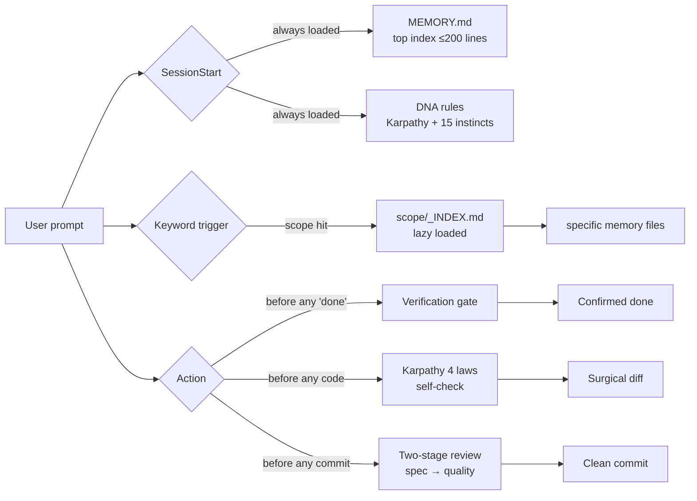

<div align="center">

# Claude Code DNA

**The behavioral operating system for Claude Code agents.**

Not another awesome-list. A battle-tested set of rules, memory architecture, and tooling
that shapes *how* the agent thinks, decides, and remembers — distilled from 11 deeply-read
libraries (179 skills + 99 agents + Karpathy's anti-patterns + memory research).

[Install in 30s](#install) · [What you get](#what-you-get) · [Examples](examples/) · [Compare](docs/COMPARISON.md) · [Troubleshoot](docs/TROUBLESHOOTING.md) · [中文](README.zh.md)

[](https://github.com/huangji6693-max/claude-code-dna)
[](LICENSE)
[](https://agentskills.io)
[](https://github.com/huangji6693-max/claude-code-dna/commits/main)
[](CONTRIBUTING.md)
[](https://github.com/huangji6693-max/claude-code-dna/discussions)

</div>

---

## The problem

You install 200 skills and 100 agents. Your `~/.claude/` is a graveyard of half-used
configs. The agent still:

- Says *"Done!"* without verifying anything
- Writes 200 lines when 50 would do
- "Refactors while it's there" and breaks your diff
- Forgets your preferences across sessions
- Burns context on irrelevant memory

The problem isn't more skills. The problem is the agent has **no consistent DNA** —
no internalized reflexes for *when to think*, *when to verify*, *what to remember*,
*what to ignore*.

## What this is

A 184KB drop-in package that gives Claude Code:

| Layer | What it does |
|---|---|
| **🧬 Rules** (8 files, ~50KB) | Behavioral reflexes — Karpathy's 4 laws, 15 operating instincts, verification gates, debugging discipline |
| **🧠 Memory system** | mem0 + langmem + GraphRAG-inspired architecture for cross-session persistence without context pollution |
| **🛠 Scripts** (3 utilities) | `memory-health` (audit), `memory-search` (BM25-style retrieval, no vector DB), `skill-spec-audit` (agentskills.io compliance) |
| **📚 Catalog** (CSV) | Curated index of 194 skills + 99 agents with category, trigger keywords, spec-compliance scoring |
| **📖 Docs** | Philosophy, decision routing tables, anti-patterns from production use |

**Zero secrets. Zero project-specific data. 100% drop-in.**

## How it works



The agent doesn't "consult" these rules — they fire as reflexes before every action.

## vs. other approaches

| | Awesome-lists | Skill bundles | **claude-code-dna** |
|---|---|---|---|
| **Ships skill source** | ❌ (links only) | ✅ | ❌ (catalog points upstream) |
| **Behavioral rules** | ❌ | ❌ | ✅ Karpathy 4 + 15 instincts |
| **Memory architecture** | ❌ | ❌ | ✅ mem0 + langmem + GraphRAG |
| **Audit tooling** | ❌ | ❌ | ✅ 3 portable bash scripts |
| **Vendor-locked** | ❌ | mostly Claude | ❌ Cursor/Codex/Gemini too |
| **Telemetry** | ❌ | varies | ❌ never |
| **Required deps** | none | varies (node, npm…) | bash + python3 |
| **Drop-in install** | manual | varies | ✅ 30s |

If you need skills, install them from upstream. If you need the *reflexes* that
make any skill actually behave — that's this repo.

## Install

```bash
git clone https://github.com/huangji6693-max/claude-code-dna.git
cd claude-code-dna
./install.sh
```

The installer:
1. Copies `rules/` to `~/.claude/rules/` (won't overwrite — backups first)
2. Symlinks `scripts/` into `~/.claude/scripts/`
3. Prints a one-line snippet to add to your `CLAUDE.md` for auto-loading
4. Runs a smoke test (`memory-health.sh`) to verify

## What you get

### 1. Karpathy 4 Laws (the daily checklist before writing code)

```
Law 1 — Think Before Coding   :  surface assumptions, don't silently pick one interpretation
Law 2 — Simplicity First      :  if 200 lines, ask "could this be 50?"
Law 3 — Surgical Changes      :  every diff line must trace to the request
Law 4 — Goal-Driven Execution :  weak goals = guaranteed failure; convert to verifiable success criteria
```

These four become reflexes. The agent stops asking permission for trivial decisions
and starts pushing back when requests are ambiguous.

### 2. 15 Operating Instincts (verification gate, TDD, root-cause discipline)

The hard rules learned from real incidents:
- **Verification gate** before any "done" claim (forbidden softeners: *should*, *probably*, *seems*, *Great!*)
- **Root cause before fix** (4-phase debugging — read → reproduce → hypothesize → fix)
- **TDD red-green-refactor** (no production code without a failing test)
- **Two-stage review** (spec compliance FIRST, code quality SECOND — never reversed)
- ...and 11 more

### 3. Memory architecture (the killer feature)

Most teams default to "throw everything into memory" → context bloat.

This DNA uses a 3-layer access pattern:

```
SessionStart inject  →  MEMORY.md top index (≤200 lines, always loaded)
Keyword hit          →  scope-specific INDEX.md (loaded on demand)
Cross-memory query   →  full file scan (only when user asks for retrospective)
```

Plus 8 hard rules from mem0 v3, langmem, GraphRAG, and Karpathy's KB-not-vector
philosophy. Result: persistent agent behavior across sessions without ballooning
every conversation's context window.

### 4. Three scripts you'll use weekly

```bash
# Audit memory health (broken links, orphans, stale files, frontmatter compliance)
$ ./scripts/memory-health.sh
[OK] MEMORY.md = 142 lines
[OK] 47 memory files (markdown-only threshold 1000)
[OK] all MEMORY.md links resolve
[WARN] 3 files untouched >90d — review expires_when
== SUMMARY: 0 err / 1 warn ==

# Local BM25-style retrieval — no vector DB needed (<1000 files)
$ ./scripts/memory-search.sh -s project-b "止损 reproducibility"
  4.21  project-b/feedback_risk_management.md
        └─ stop-loss must be atomic write; verified with replay

# Audit skills against agentskills.io spec (name format, length, frontmatter)
$ ./scripts/skill-spec-audit.sh ~/.claude/skills
Total skills: 194
PASS: 168    WARN: 23    FAIL: 3
```

### 5. Skill + agent catalog

`catalog/skills.csv` and `catalog/agents.csv` — categorized, trigger-keyword-tagged,
spec-audited indexes of every major skill and agent in circulation. Use them to:
- Decide which skills to install (we don't ship the skills themselves — see [philosophy](#philosophy))
- Find the right agent by trigger keyword
- Audit your own collection for redundancy

## Philosophy

**This repo deliberately does *not* re-distribute skills/agents source code** from
upstream projects (anthropics/skills, forrestchang/karpathy-skills, ECC, etc.).

Why: licensing complexity, attribution debt, and the catalog is more valuable when
it indexes the real upstream rather than a stale snapshot.

**What we ship is original**: the DNA rules synthesized from cross-library reading,
the memory architecture, the audit tooling, and the curated index.

If you want the actual skills, the catalog points to each one's home.

## Project structure

```
claude-code-dna/
├── rules/                      # Behavioral reflexes (auto-loaded by CLAUDE.md)
│   ├── karpathy-4-laws.md      # ⭐ Read this first
│   ├── operating-instincts.md  # 15 hard rules
│   ├── dna-routing-table.md    # 11-lib scenario routing
│   ├── pageindex-essence.md    # vectorless RAG decision guide
│   ├── seo-geo-essence.md      # SEO + GEO (LLM citation optimization)
│   └── warp-ruflo-skills-essence.md
├── memory-system/
│   └── memory-optimization.md  # mem0/langmem/GraphRAG synthesis · 8 laws
├── scripts/
│   ├── memory-health.sh
│   ├── memory-search.sh
│   └── skill-spec-audit.sh
├── catalog/
│   ├── skills.csv              # 194 skills indexed
│   └── agents.csv              # 99 agents indexed
├── docs/
│   ├── PHILOSOPHY.md           # Why this exists + attribution
│   ├── COMPARISON.md           # vs SuperClaude / agent-rules / 5 more
│   └── TROUBLESHOOTING.md      # Install / memory / audit / behavior fixes
├── examples/
│   ├── CLAUDE.md               # Minimal / recommended / project-layered imports
│   ├── verification-gate-demo.md   # Before/after of the gate firing
│   ├── karpathy-laws-in-action.md  # 4 real refactoring pairs
│   └── memory-workflow.md      # Day-1 to day-60 walkthrough
├── install.sh
├── LICENSE
└── README.md
```

## Compatibility

- **Claude Code** (primary target)
- **Cursor** — rules are markdown, drop them into `.cursorrules` or `.cursor/rules/`
- **Codex / Gemini CLI / any agent harness** — rules are model-agnostic; memory
  scripts use only `bash` + `awk` + `python3`
- **Warp** — `agentskills.io` spec is identical between Anthropic and Warp; skill
  catalog audit applies to both

## FAQ

**Q: Why no vector DB for memory search?**
At <1000 markdown files (personal/project memory scale), BM25 + a hand-tuned
index beats embeddings on both latency and answer quality. The dimensionality
crossover is roughly 5k–10k files. If you go past that, swap `memory-search.sh`
for a vector backend — the rest of the architecture doesn't care.

**Q: Why don't you bundle the actual skills?**
Three reasons: (1) licensing — mixing skills from 11 different repos under one
MIT umbrella creates attribution debt, (2) staleness — a bundled snapshot is
stale the day after upstream releases, (3) misaligned incentives — re-distributing
is cheap (rsync), curating is hard. The catalog points at upstream homes.

**Q: How is this different from agentskills.io?**
agentskills.io is the **spec** for how a SKILL.md file should be structured.
This repo is **everything that fires before the agent picks a skill** — the
reflexes, memory, and verification gates. Complementary, not competing.
`scripts/skill-spec-audit.sh` validates skills against agentskills.io spec.

**Q: Does this work with Cursor / Codex / Gemini CLI?**
Yes. Rules are markdown — drop them into `.cursorrules`, `.cursor/rules/`,
or any agent harness's rule directory. Memory scripts use only bash + python3.

**Q: What about prompt injection in rule files?**
Same threat surface as any markdown file your agent reads. See
[SECURITY.md](SECURITY.md) for our policy and reporting process.

**Q: Why isn't there a vector DB / RAG / autonomous loop?**
This repo's bar is "would I miss this if it weren't there?" — every rule traces
to a real incident, not a hypothetical capability. Aspirational features get
rejected in PR.

## Read more

Concrete walkthroughs you can evaluate in <5 minutes each — no install required:

- [examples/verification-gate-demo.md](examples/verification-gate-demo.md) — the verification gate firing on a real regression
- [examples/karpathy-laws-in-action.md](examples/karpathy-laws-in-action.md) — 4 before/after refactoring pairs, one per law
- [examples/memory-workflow.md](examples/memory-workflow.md) — 3-layer memory architecture from day 1 through day 60
- [docs/COMPARISON.md](docs/COMPARISON.md) — honest comparison vs SuperClaude, agent-rules, memory-bank + 4 more
- [docs/TROUBLESHOOTING.md](docs/TROUBLESHOOTING.md) — install / memory / audit / behavioral / compatibility fixes
- [docs/PHILOSOPHY.md](docs/PHILOSOPHY.md) — three principles + 11-library attribution

## Star history

[](https://star-history.com/#huangji6693-max/claude-code-dna&Date)

## Roadmap

- [ ] English translations of all rules (current: Chinese + English mix)
- [ ] GIF demo of the verification gate in action
- [ ] `dna-doctor.sh` — single-command health check across rules + memory + scripts
- [ ] Plugin for direct `~/.claude/` install via `claude-code-cli`
- [ ] More agent-harness compatibility examples (Cursor, Codex, Gemini CLI)

## Acknowledgments

This DNA is synthesized from 11 deeply-read libraries:

- [anthropics/skills](https://github.com/anthropics/skills) — agentskills.io spec authority
- [obra/superpowers](https://github.com/obra/superpowers) — verification + TDD reflexes
- [forrestchang/andrej-karpathy-skills](https://github.com/forrestchang/andrej-karpathy-skills) — anti-patterns
- [mem0ai/mem0](https://github.com/mem0ai/mem0) — ADD-only memory
- [langchain-ai/langmem](https://github.com/langchain-ai/langmem) — 3 types × 2 timings
- [microsoft/graphrag](https://github.com/microsoft/graphrag) — community-summary indexing
- [ruvnet/claude-flow](https://github.com/ruvnet/claude-flow) — agent orchestration
- [warpdotdev/warp](https://github.com/warpdotdev/warp) — block-as-object + spec-PR
- [VectifyAI/PageIndex](https://github.com/VectifyAI/PageIndex) — vectorless RAG
- + several private collections distilled into open-shareable form

If any rule is recognizably from your work and not attributed, open an issue —
attribution will be fixed immediately.

## License

MIT — see [LICENSE](LICENSE). Use freely in commercial projects.

## Contributing

PRs welcome for:
- Translation (Chinese → English, others)
- New decision routing tables for additional libraries
- Better catalog scoring methodology
- Real-world `examples/` of CLAUDE.md integrations

See [CONTRIBUTING.md](CONTRIBUTING.md).

---

<div align="center">

**If this saves you one bad agent decision, star it.**
**If it saves you twenty, [tell someone](https://twitter.com/intent/tweet?text=Just%20found%20claude-code-dna%20—%20the%20missing%20behavioral%20OS%20for%20Claude%20Code&url=https://github.com/huangji6693-max/claude-code-dna).**

</div>
