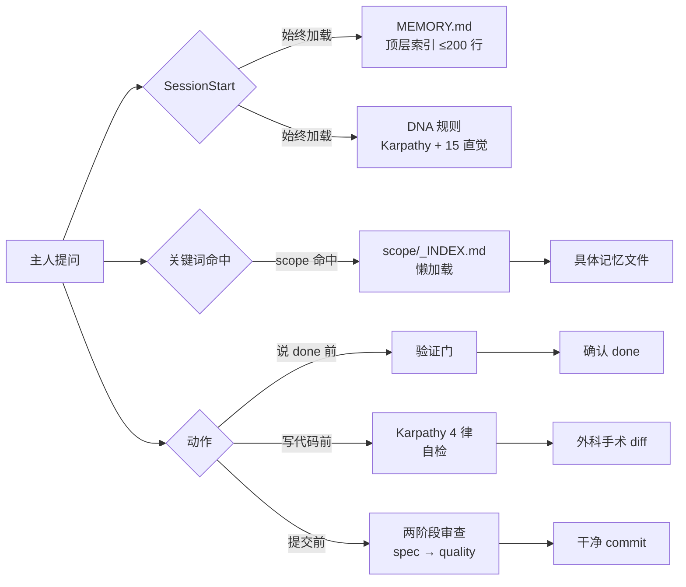

<div align="center">

# Claude Code DNA

**Claude Code agent 的行为操作系统。**

不是又一个 awesome-list。一套经过实战检验的规则、记忆架构、工具链 —
从 11 个精读的库（179 skill + 99 agent + Karpathy 反模式 + 记忆研究）里提炼出来，
塑造 agent *如何* 思考、决策、记忆。

[30 秒安装](#安装) · [包含什么](#包含什么) · [示例](examples/) · [对比](docs/COMPARISON.md) · [排错](docs/TROUBLESHOOTING.md) · [English](README.md)

[](https://github.com/huangji6693-max/claude-code-dna)
[](LICENSE)
[](https://agentskills.io)
[](https://github.com/huangji6693-max/claude-code-dna/commits/main)
[](CONTRIBUTING.md)
[](https://github.com/huangji6693-max/claude-code-dna/discussions)

</div>

---

## 问题

装了 200 个 skill、100 个 agent，`~/.claude/` 一堆半残配置。agent 还是：

- 没验证就喊 *"完成！"*
- 50 行能搞定的功能写 200 行
- "顺手重构一下" 把 diff 搞乱
- 跨会话忘记你的偏好
- 把上下文烧在不相关的记忆上

问题不是 skill 不够多。问题是 agent **没有一致的 DNA** —
没有内化的反射：*什么时候该想*、*什么时候该验证*、*该记什么*、*该忽略什么*。

## 这是什么

一个 184KB 的 drop-in 包，给 Claude Code：

| 层 | 作用 |
|---|---|
| **🧬 规则**（8 文件 ~50KB） | 行为反射 — Karpathy 4 律、15 条操作直觉、验证门、调试纪律 |
| **🧠 记忆系统** | mem0 + langmem + GraphRAG 启发的架构，跨会话持久化但不污染上下文 |
| **🛠 脚本**（3 个工具） | `memory-health`（审计）、`memory-search`（BM25 风格本地检索）、`skill-spec-audit`（agentskills.io 合规） |
| **📚 目录**（CSV） | 194 skill + 99 agent 的分类、关键词、合规评分索引 |
| **📖 文档** | 哲学、决策路由表、生产环境反模式 |

**零密钥。零项目数据。100% drop-in。**

## 怎么运作



Agent 不是"查询"这些规则 — 它们在每个动作前作为反射触发。

## 对比其他方案

| | Awesome 列表 | Skill 包 | **claude-code-dna** |
|---|---|---|---|
| **打包 skill 源码** | ❌（只放链接） | ✅ | ❌（catalog 指向上游） |
| **行为规则** | ❌ | ❌ | ✅ Karpathy 4 + 15 直觉 |
| **记忆架构** | ❌ | ❌ | ✅ mem0 + langmem + GraphRAG |
| **审计工具** | ❌ | ❌ | ✅ 3 个便携 bash 脚本 |
| **绑定厂商** | ❌ | 多数绑 Claude | ❌ Cursor/Codex/Gemini 都行 |
| **埋点** | ❌ | 各异 | ❌ 永不 |
| **强制依赖** | 无 | 各异（node, npm…） | bash + python3 |
| **drop-in 安装** | 手动 | 各异 | ✅ 30 秒 |

要 skill 本身 → 上游装。要让任何 skill 真正"按反射行动"的那些直觉 → 这个仓。

## 安装

```bash
git clone https://github.com/huangji6693-max/claude-code-dna.git
cd claude-code-dna
./install.sh
```

安装器会：
1. 复制 `rules/` 到 `~/.claude/rules/`（不覆盖 — 先备份）
2. 把 `scripts/` 软链到 `~/.claude/scripts/`
3. 打印一行片段，让你贴到 `CLAUDE.md` 自动加载
4. 跑 `memory-health.sh` 烟测

## 包含什么

### 1. Karpathy 4 律（写代码前的日常清单）

```
律 1 — Think Before Coding   : 暴露假设，不要默默挑一个解读
律 2 — Simplicity First       : 200 行能 50 行就重写
律 3 — Surgical Changes       : 每行 diff 都能追溯到原始请求
律 4 — Goal-Driven Execution  : 弱目标 = 必失败；转化为可验证 success criteria
```

这四条变成反射。agent 不再为琐事请示，反而会在请求模糊时推回。

### 2. 15 条操作直觉（验证门、TDD、根因纪律）

从真实事故学来的硬规则：
- 任何 "done" 声明前必经**验证门**（禁止软化词：*should*、*probably*、*seems*、*Great!*）
- **根因先于修复**（4 阶段调试 — 读 → 重现 → 假设 → 修）
- **TDD red-green-refactor**（没有失败测试不写生产代码）
- **两阶段审查**（先 Spec 合规、再代码质量 — 永不反过来）
- ...还有 11 条

### 3. 记忆架构（杀手锏）

大多数团队默认 "把所有东西塞记忆里" → 上下文爆炸。

本 DNA 用 3 层访问模式：

```
SessionStart 注入   →  MEMORY.md 顶层索引（≤200 行，始终加载）
关键词命中           →  scope 专属 INDEX.md（按需加载）
跨记忆查询           →  全文件扫描（仅当用户喊"复盘"）
```

加上 mem0 v3、langmem、GraphRAG、Karpathy KB-not-vector 哲学的 8 条硬规则。
结果：agent 行为跨会话持久，但每次对话上下文不膨胀。

### 4. 三个每周都用的脚本

```bash
# 审计记忆健康度（坏链接、孤儿、陈旧文件、frontmatter 合规）
$ ./scripts/memory-health.sh

# 本地 BM25 风格检索 — <1000 文件无需向量库
$ ./scripts/memory-search.sh -s project-b "止损 复现性"

# 按 agentskills.io spec 审计 skill（name 格式、行数、frontmatter）
$ ./scripts/skill-spec-audit.sh ~/.claude/skills
```

### 5. Skill + Agent 目录

`catalog/skills.csv` 和 `catalog/agents.csv` — 分类、关键词、合规审计的索引。
用来：
- 决定装哪些 skill（**本仓库不分发 skill 源码** — 见[哲学](#哲学)）
- 通过关键词找对的 agent
- 审计自己收藏夹的冗余

## 哲学

**本仓库刻意不重新分发** 上游项目（anthropics/skills、forrestchang/karpathy-skills、ECC 等）的 skill / agent 源码。

原因：许可证复杂、归因债、目录索引真实上游比快照快照更有价值。

**我们交付的是原创**：跨库精读综合的 DNA 规则、记忆架构、审计工具、精选索引。

要 skill 本身？目录指向每个的家。

## 兼容性

- **Claude Code**（主要目标）
- **Cursor** — 规则是 markdown，丢进 `.cursorrules` 或 `.cursor/rules/`
- **Codex / Gemini CLI / 任何 agent 框架** — 规则模型无关，记忆脚本只用 `bash + awk + python3`
- **Warp** — `agentskills.io` spec Anthropic / Warp 完全一致

## FAQ

**问：为什么记忆搜索不用向量库？**
个人/项目记忆规模 <1000 markdown 文件，BM25 + 手调索引在延迟和召回质量上都赢
embedding。维度交叉点大概在 5k–10k 文件。超过了换 `memory-search.sh` 后端就行，
架构其他部分不关心。

**问：为什么不直接打包 skill 源码？**
三个原因：(1) 许可证 — 11 个仓的 skill 混到一个 MIT 伞下创造归因债 ; (2) 过时 —
打包快照在上游发版后第二天就过时；(3) 激励错配 — 重发只用 rsync 很便宜，但策划
索引很难。catalog 指向每个上游的家。

**问：跟 agentskills.io 什么区别？**
agentskills.io 是 SKILL.md 文件**结构的规范**。这个仓是**在 agent 选 skill 之前
所有要触发的东西** —— 反射、记忆、验证门。互补不冲突。`scripts/skill-spec-audit.sh`
按 agentskills.io spec 审计你的 skill 集。

**问：能用于 Cursor / Codex / Gemini CLI 吗？**
能。规则是 markdown，丢进 `.cursorrules`、`.cursor/rules/`，或任何 agent harness
的规则目录都行。记忆脚本只用 bash + python3。

**问：rule 文件被 prompt injection 怎么办？**
跟 agent 读的任何 markdown 文件威胁面相同。看 [SECURITY.md](SECURITY.md) 了解
我们的政策和上报流程。

**问：为什么没向量库 / RAG / 自循环？**
这个仓的标准是"如果它没了我会怀念吗？" — 每条规则都追溯到真实事故，不是假想能力。
"未来可能用得到"的功能 PR 阶段就拒。

## 深入阅读

不用 install 也能 5 分钟评估的具体走查：

- [examples/verification-gate-demo.md](examples/verification-gate-demo.md) — 验证门在一次真实回退上触发的全过程
- [examples/karpathy-laws-in-action.md](examples/karpathy-laws-in-action.md) — 4 律的 before/after 重构对照
- [examples/memory-workflow.md](examples/memory-workflow.md) — 3 层记忆架构从 day 1 到 day 60 的完整路径
- [docs/COMPARISON.md](docs/COMPARISON.md) — 对比 SuperClaude / agent-rules / memory-bank 等 7 个邻居项目
- [docs/TROUBLESHOOTING.md](docs/TROUBLESHOOTING.md) — 安装 / 记忆 / 审计 / 行为 / 兼容性问题修复
- [docs/PHILOSOPHY.md](docs/PHILOSOPHY.md) — 三大原则 + 11 库归属表

## Star 历史

[](https://star-history.com/#huangji6693-max/claude-code-dna&Date)

## 致谢

本 DNA 综合自 11 个精读库：

- [anthropics/skills](https://github.com/anthropics/skills) — agentskills.io spec 权威
- [obra/superpowers](https://github.com/obra/superpowers) — 验证 + TDD 反射
- [forrestchang/andrej-karpathy-skills](https://github.com/forrestchang/andrej-karpathy-skills) — 反模式
- [mem0ai/mem0](https://github.com/mem0ai/mem0) — ADD-only 记忆
- [langchain-ai/langmem](https://github.com/langchain-ai/langmem) — 3 类型 × 2 时机
- [microsoft/graphrag](https://github.com/microsoft/graphrag) — 社区摘要索引
- [ruvnet/claude-flow](https://github.com/ruvnet/claude-flow) — agent 编排
- [warpdotdev/warp](https://github.com/warpdotdev/warp) — block-as-object + spec-PR
- [VectifyAI/PageIndex](https://github.com/VectifyAI/PageIndex) — vectorless RAG
- 以及若干私人收藏蒸馏出的可公开版本

如果某条规则可识别出自你的工作但未归因，开 issue —
会立即修正归因。

## 许可

MIT — 见 [LICENSE](LICENSE)。商用自由。

## 贡献

PR 欢迎：
- 翻译（中→英、其他语言）
- 新库的决策路由表
- 更好的目录评分方法
- 真实的 `examples/` CLAUDE.md 集成

见 [CONTRIBUTING.md](CONTRIBUTING.md)。

---

<div align="center">

**如果它省你一次烂决策，给个 star。**
**省你二十次？[告诉别人](https://twitter.com/intent/tweet?text=%E5%88%9A%E5%8F%91%E7%8E%B0%20claude-code-dna%20%E2%80%94%20Claude%20Code%20%E7%BC%BA%E7%9A%84%E8%A1%8C%E4%B8%BA%E6%93%8D%E4%BD%9C%E7%B3%BB%E7%BB%9F&url=https://github.com/huangji6693-max/claude-code-dna)。**

</div>
